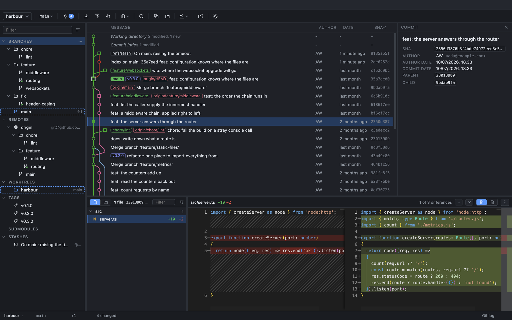
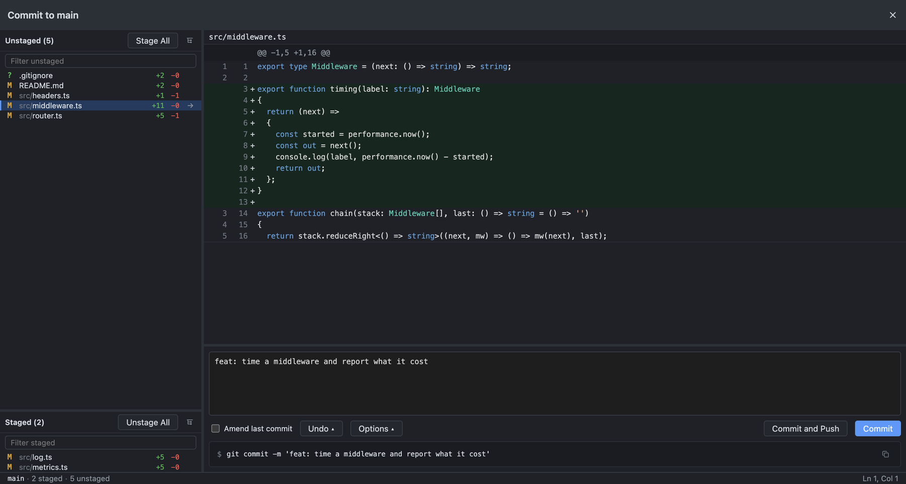
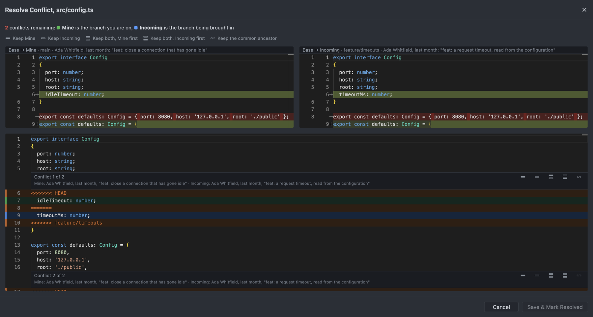
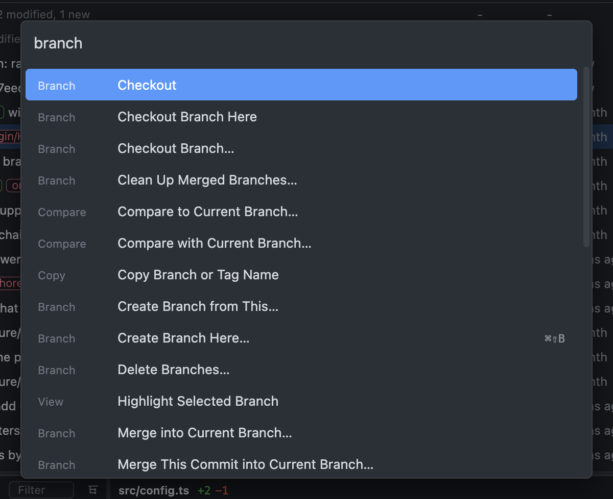

<div align="center">

# gitext

### A Git client for macOS that shows its work.

[](LICENSE)


</div>



## Committing



Staged and unstaged on the left, the diff, the message.

## Conflicts

A conflict raises the resolver. Resolve it in the app, or hand it to whatever `merge.tool`
you have configured.



## Cmd+P



Every command in the app, by name, with its shortcut beside it.

## Requirements

- macOS
- Node.js 20+
- Git 2.20+

## Quick start

```bash
npm install
npm run dev
```

## Scripts

```bash
npm run dev        # dev server with HMR
npm run build      # bundle to out/
npm test           # unit + integration tests, driving real git
npm run test:e2e   # the built app, driven under Playwright
npm run typecheck  # tsc + vue-tsc
npm run dist       # package an installer
```

## Status

Early development. macOS is the only platform anything is verified on.
[AGENTS.md](AGENTS.md) says what is in flight.

## Docs

- [AGENTS.md](AGENTS.md): where to start on a feature or a fix
- [docs/ARCHITECTURE.md](docs/ARCHITECTURE.md): how it is put together, and standing decisions
- [docs/DIALOGS.md](docs/DIALOGS.md): what a dialog is here, and the rules every one follows
- [docs/GIT-GRAPH.md](docs/GIT-GRAPH.md): the revision graph, from `git log` to pixels
- [docs/GIT-OUTPUT.md](docs/GIT-OUTPUT.md): what git prints, and where it surfaces
- [CLAUDE.md](CLAUDE.md): conventions for working in this codebase

## License

**[MIT](LICENSE).**

Its direct dependencies (Vue, Pinia, Electron, Monaco Editor, and others) are used under
their own licenses, all MIT; [NOTICE.md](NOTICE.md) lists them.
